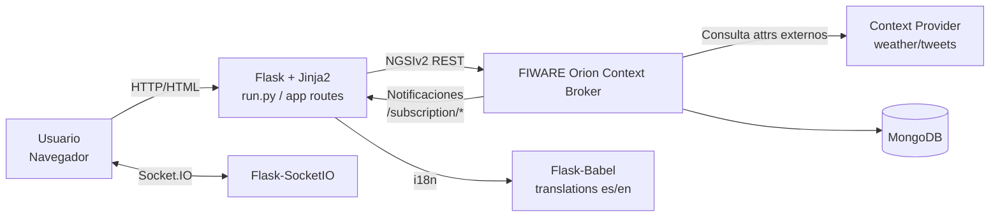
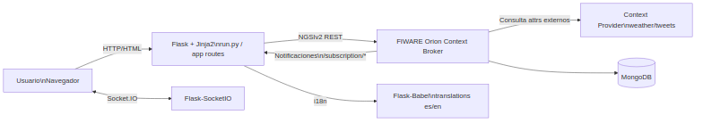
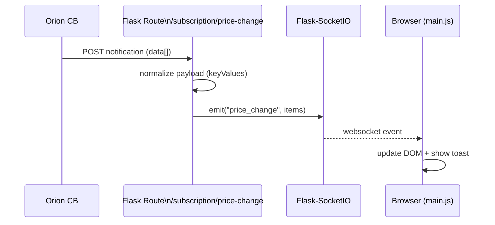
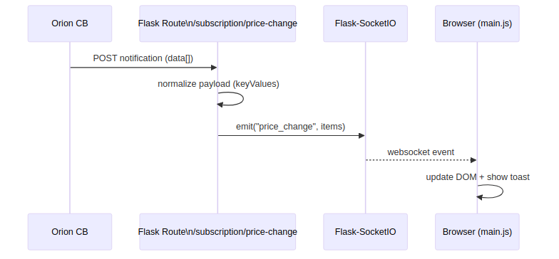
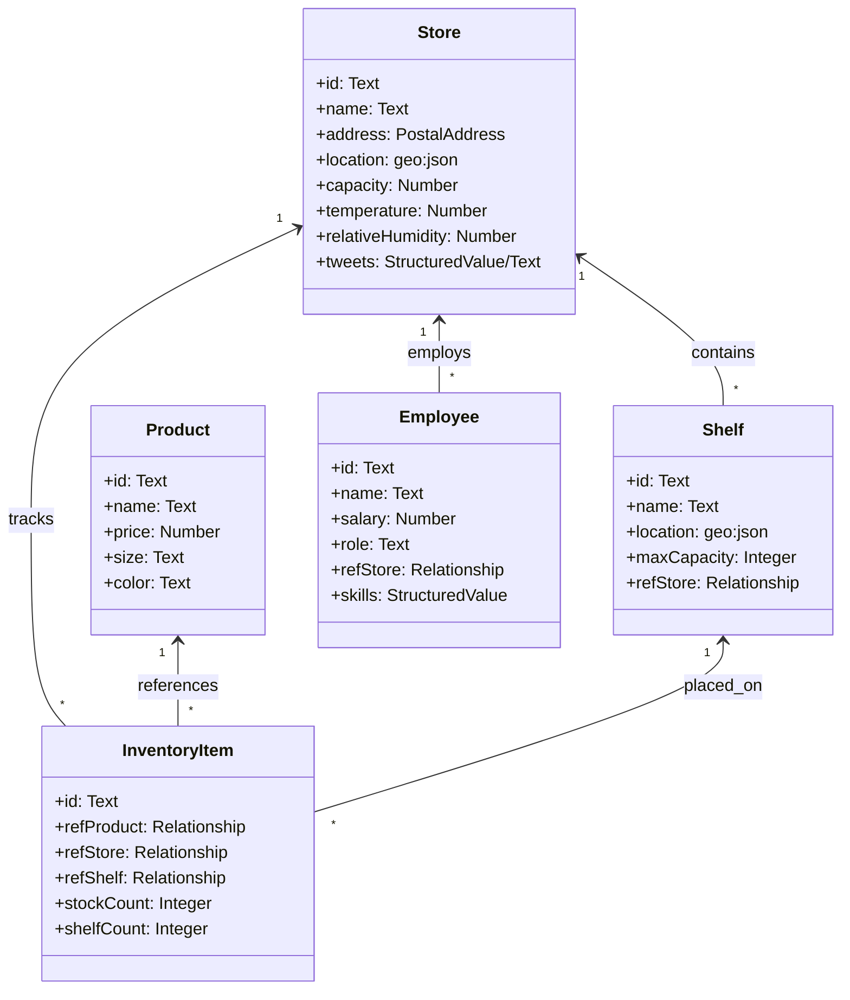

# Capitulo de Arquitectura del Sistema

## 1. Introduccion

Este capitulo describe la arquitectura de la aplicacion **FIWARE Supermarkets**, una solucion web para gestion de supermercados construida sobre FIWARE Orion (NGSIv2) como sistema de registro principal.

La aplicacion sigue una arquitectura web por capas con los siguientes objetivos:

- Mantener a Orion como fuente unica de verdad para las entidades de negocio.
- Exponer una interfaz web simple para operaciones CRUD y flujos operativos.
- Integrar datos contextuales externos (meteorologia y tweets) mediante registros de proveedor en Orion.
- Proporcionar notificaciones en tiempo real al cliente web a traves de Socket.IO.
- Ofrecer soporte multilenguaje (es/en) desde el lado servidor y cliente.

## 2. Vision global de arquitectura

A nivel macro, el sistema se compone de:

- **Cliente web** (navegador): renderizado de vistas HTML, ejecucion de JavaScript y recepcion de eventos en tiempo real.
- **Aplicacion Flask**: capa de presentacion y logica de aplicacion.
- **FIWARE Orion Context Broker**: persistencia y consulta de entidades NGSIv2.
- **MongoDB**: almacenamiento interno utilizado por Orion.
- **Context Provider**: proveedor externo de atributos para entidades Store.

### 2.1 Diagrama (Mermaid)

### 2.2 Diagrama (Imagen generada)

Fuente del diagrama: `docs/diagrams/arquitectura-global.mmd`.

## 3. Estilo arquitectonico y justificacion

La solucion adopta un estilo **monolito modular** en el servidor (Flask), con integracion externa por API REST (Orion, Context Provider). Esta eleccion es adecuada para un TFG por los siguientes motivos:

- Reduce complejidad operativa frente a microservicios.
- Mantiene separacion clara de responsabilidades por modulos Python.
- Permite iterar con rapidez en funcionalidad y pruebas.
- Facilita despliegue local para evaluacion academica.

Aunque se usa un unico proceso de aplicacion, existe una separacion logica en capas:

- Capa de presentacion: plantillas Jinja2, CSS, JS.
- Capa de aplicacion: rutas Flask y reglas de negocio.
- Capa de integracion: cliente Orion y bootstrap de registros/suscripciones.
- Capa de datos: Orion + MongoDB.

## 4. Componentes del backend

### 4.1 Punto de entrada y creacion de app

- `run.py`: crea la aplicacion (`create_app`) y levanta Socket.IO.
- `app/__init__.py`: inicializa Flask, Babel, SocketIO y registra blueprint de rutas.

Aspectos relevantes:

- Se carga configuracion desde entorno (`app/config.py`).
- Se inyecta contexto i18n para JavaScript en cada respuesta HTML.
- Se instancia `OrionClient` y se almacena en `app.extensions`.
- Si `AUTO_BOOTSTRAP=true`, se garantizan registros de proveedores y suscripciones.
- Se resuelve `SOCKETIO_ASYNC_MODE` para compatibilidad con runtime de desarrollo.

### 4.2 Modulo de configuracion

`app/config.py` centraliza parametros de ejecucion:

- `ORION_BASE_URL`, `ORION_TIMEOUT`
- `CONTEXT_PROVIDER_URL`, `APP_BASE_URL`
- `FIWARE_SERVICE`, `FIWARE_SERVICEPATH`
- `AUTO_BOOTSTRAP`, `SOCKETIO_ASYNC_MODE`
- `BABEL_DEFAULT_LOCALE`, `LANGUAGES`

Este enfoque desacopla codigo de entorno y permite despliegues configurables.

### 4.3 Cliente FIWARE y serializacion NGSIv2

`app/fiware.py` implementa:

- Cliente HTTP tipado para Orion (`OrionClient`).
- Operaciones CRUD y operativas NGSIv2 (`/v2/entities`, `/v2/op/update`, `/v2/subscriptions`, `/v2/registrations`).
- Conversion de formularios a entidades NGSIv2 (funciones `to_*_entity`).
- Generacion de IDs con formato URN (`make_id`).
- Bootstrap de proveedores externos y suscripciones.

Las entidades de dominio gestionadas son:

- `Store`
- `Product`
- `Shelf`
- `InventoryItem`
- `Employee`

### 4.4 Rutas y logica de aplicacion

`app/routes.py` define:

- Vistas HTML: home, productos, tiendas, empleados, mapa.
- Endpoints CRUD para `Store`, `Product`, `Employee`.
- Endpoints operativos para `Shelf` e `InventoryItem`.
- Endpoints API auxiliares para selects dinamicos.
- Endpoints de notificacion Orion (`/subscription/*`).

Reglas de negocio destacables:

- Compra (`/inventory/<id>/buy`) decrementa `shelfCount` y `stockCount` en Orion.
- Compra bloqueada si `shelfCount <= 0`.
- API de disponibilidad evita duplicidades producto-estante.

## 5. Arquitectura frontend

El frontend se apoya en renderizado servidor + JavaScript progresivo:

- Plantillas: `app/templates/*`
- Estilos: `app/static/css/styles.css`
- Logica cliente: `app/static/js/main.js`

Capacidades principales del cliente:

- Conexion Socket.IO para eventos en tiempo real.
- Toasts globales para avisos de negocio.
- Actualizacion dinamica de precios en DOM.
- Carga resiliente de Leaflet para mapa de tiendas.
- Validacion de formularios HTML5 con refuerzo JS.
- Carga de opciones dinamicas en formularios de inventario.

## 6. Integracion FIWARE: registros y suscripciones

Durante el arranque (si `AUTO_BOOTSTRAP=true`), la app ejecuta dos procesos:

- **Registros de proveedor externo**: para tiendas `001..004`, atributos `temperature`, `relativeHumidity`, `tweets`.
- **Suscripciones Orion**:
  - Cambio de precio en `Product.price`.
  - Bajo stock por tienda con condicion `shelfCount<10` y filtro por `refStore`.

Este diseño evita configuracion manual tras cada despliegue y garantiza consistencia de integracion.

## 7. Flujo de tiempo real

El flujo completo de notificacion es:

1. Orion detecta cambio en entidad suscrita.
2. Orion invoca endpoint HTTP de suscripcion en Flask.
3. Flask normaliza payload a estructura key-value.
4. Flask emite evento Socket.IO.
5. Navegador recibe evento y actualiza interfaz.

### 7.1 Diagrama (Mermaid)

### 7.2 Diagrama (Imagen generada)

Fuente del diagrama: `docs/diagrams/secuencia-tiempo-real.mmd`.

## 8. Modelo de datos y relaciones

La aplicacion usa un modelo de entidades NGSIv2 con relaciones explicitas por referencia:

- `Shelf.refStore -> Store.id`
- `InventoryItem.refStore -> Store.id`
- `InventoryItem.refShelf -> Shelf.id`
- `InventoryItem.refProduct -> Product.id`
- `Employee.refStore -> Store.id`

### 8.1 Diagrama de dominio (Mermaid)

## 9. Internacionalizacion (i18n)

La internacionalizacion se implementa con `Flask-Babel` y catalogos gettext.

Prioridad de resolucion de idioma:

1. Query param `?lang=`
2. Sesion
3. Cookie `lang`
4. Cabecera `Accept-Language`
5. Idioma por defecto (`es`)

Adicionalmente:

- La plantilla base expone un objeto `window.I18N` para textos JS.
- Mensajes de notificaciones en tiempo real se renderizan en el idioma activo.
- Se soportan catalogos en `translations/es` y `translations/en`.

## 10. Despliegue y ejecucion

### 10.1 Infraestructura local

`docker-compose.yml` orquesta servicios base:

- Orion Context Broker
- MongoDB
- Context Provider (tutorial)

Scripts de apoyo:

- `./services start`
- `./services stop`
- `import-data` para carga inicial

### 10.2 Ejecucion aplicacion

- Dependencias Python en `requirements.txt`
- Arranque principal: `python run.py`
- Puerto por defecto: `5000`

## 11. Calidad arquitectonica

### 11.1 Fortalezas

- Separacion modular backend/frontend clara para proyecto academico.
- Integracion FIWARE robusta con bootstrap automatico.
- Modelo de datos consistente con relaciones explicitas.
- Reactividad en interfaz sin frameworks complejos.
- Soporte i18n transversal (servidor + cliente).

### 11.2 Riesgos y limitaciones

- Monolito Python limita escalado horizontal fino sin ajustes adicionales.
- Dependencia fuerte de disponibilidad Orion para operacion completa.
- Seguridad de credenciales de empleados en texto plano (debe endurecerse).
- Falta de colas para desacoplar notificaciones de eventos de alta frecuencia.

### 11.3 Mejoras futuras

- Hash de contrasenas (`bcrypt`/`argon2`) y endurecimiento de autenticacion.
- Cache selectiva de lecturas frecuentes para reducir carga en Orion.
- Telemetria (trazas, metricas, logs estructurados).
- Pruebas de integracion end-to-end sobre flujos de suscripcion.
- Contenerizacion de la app Flask para despliegue reproducible.

## 12. Conclusiones del capitulo

La arquitectura implementada cumple adecuadamente los objetivos funcionales del sistema y es coherente con el alcance de un TFG orientado a IoT/contexto con FIWARE. El uso de Orion como nucleo de datos, combinado con Flask para capa de aplicacion y Socket.IO para tiempo real, ofrece una solucion didactica, extensible y suficientemente robusta para demostrar diseno de software, integracion de plataformas y buenas practicas de estructuracion modular.
