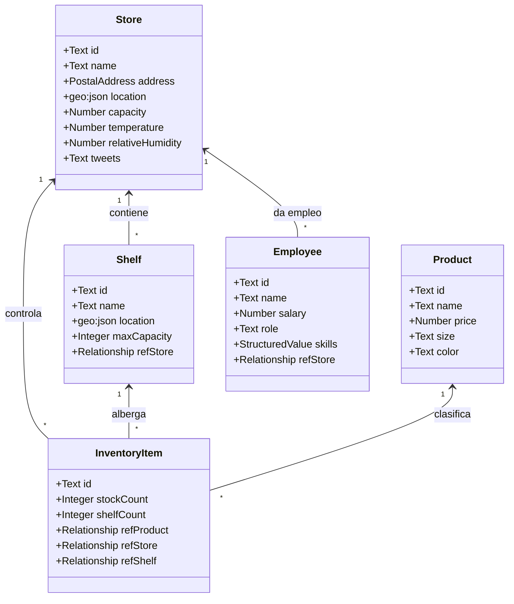
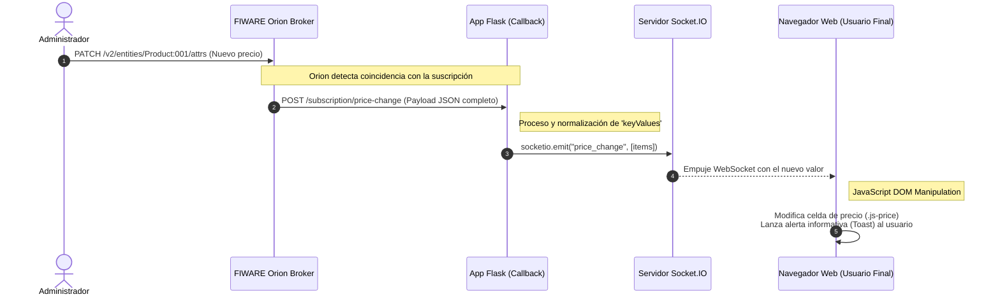

# Capítulo: Arquitectura del Sistema

## 1. Introducción

El presente capítulo tiene como objetivo describir de forma exhaustiva la arquitectura de software diseñada e implementada para la aplicación **FIWARE Supermarkets**. Esta solución web, orientada a la gestión inteligente e interactiva de una cadena de supermercados, se apoya fundamentalmente en la plataforma **FIWARE**, utilizando su componente central, el **Orion Context Broker**, como gestor principal de la información de contexto.

El diseño arquitectónico persigue los siguientes atributos de calidad:
- **Desacoplamiento parcial:** Separación clara entre la interfaz de usuario, la lógica de la aplicación y la gestión de los datos de contexto.
- **Interactividad en tiempo real:** Capacidad de reflejar cambios de estado (como actualizaciones de precios o alertas de inventario) en el cliente sin recargar la página.
- **Extensibilidad:** Facilidad para incorporar nuevas fuentes de datos externas o nuevos módulos funcionales en el futuro.
- **Internacionalización:** Soporte nativo y transversal para múltiples idiomas (español e inglés) desde el inicio del desarrollo.

Para lograrlo, la aplicación sigue un patrón de arquitectura web clásica por capas o de "monolito modular", apoyándose en tecnologías modernas y estándares abiertos.

## 2. Tecnologías Utilizadas

La materialización de la arquitectura propuesta se apoya en un conjunto de tecnologías seleccionadas por su madurez, popularidad y excelente ecosistema de desarrollo:

### 2.1. Backend y Lógica de Aplicación
- **Python:** Lenguaje principal de desarrollo.
- **Flask:** Micro-framework web utilizado para construir el servidor HTTP, gestionar las rutas web (endpoints) y procesar las peticiones.
- **Flask-SocketIO:** Extensión de Flask que proporciona soporte para WebSockets, permitiendo la comunicación bidireccional y de baja latencia entre el servidor y los clientes conectados.
- **Flask-Babel:** Extensión que facilita la internalización (i18n) y localización (l10n), permitiendo la traducción de la interfaz de usuario mediante catálogos *gettext*.

### 2.2. Interfaz de Usuario (Frontend)
- **Jinja2:** Motor de plantillas integrado en Flask para el renderizado HTML dinámico desde el servidor.
- **HTML5, CSS y Vanilla JavaScript:** Utilizados para maquetación, estilo y lógica progresiva del cliente, sin añadir la complejidad de frameworks tipo React o Angular.
- **Socket.IO (Cliente):** Librería JavaScript para conectarse al servidor WebSocket y reaccionar a los eventos en tiempo real.
- **Leaflet:** Librería JavaScript ligera para la renderización de mapas interactivos que visualizan la ubicación global de los supermercados.

### 2.3. Gestión de Datos y Contexto (FIWARE)
- **FIWARE Orion Context Broker:** Componente central del ecosistema FIWARE que provee una API REST estándar (NGSIv2) para gestionar y consultar el ciclo de vida de la información de contexto.
- **MongoDB:** Motor de bases de datos NoSQL utilizado internamente por Orion para la persistencia del estado de las entidades.
- **Context Providers externos:** Servicios adicionales simulados que proveen información dinámica complementaria a Orion (como condiciones meteorológicas en tiempo real o métricas de redes sociales).

---

## 3. Visión Global del Sistema

El sistema presenta una arquitectura distribuida donde el backend de Flask actúa como un cliente inteligente de FIWARE Orion y, simultáneamente, como servidor para los navegadores web. 

La aplicación centraliza la lógica empresarial básica y funciona como puente u orquestador entre el frontend y la plataforma de contexto. Orion se erige como la fuente única de verdad para todas las entidades físicas y lógicas del dominio (Tiendas, Productos, Estantes, Inventarios, etc.).

A continuación, se detalla esta infraestructura mediante diagramas formales.

### 3.1. Diagrama Estructural (Mermaid)

```mermaid
flowchart LR
    subgraph Capa de Presentación
        U[Navegador Web / Usuario]
    end

    subgraph Capa de Aplicación
        F[Flask App\n(Rutas, Vistas, i18n)]
        S[Flask-SocketIO\n(WebSockets)]
        T[Flask-Babel\n(Traducciones es/en)]
    end

    subgraph Capa de Datos y Contexto (FIWARE)
        O[FIWARE Orion\nContext Broker]
        M[(MongoDB)]
        C[Context Provider\n(Meteorología / Tweets)]
    end

    %% Relaciones
    U -->|HTTP / Formularios| F
    U <-->|Eventos Socket.IO| S
    F <-->|Llamadas internas| S
    F -->|Traducción| T
    F -->|CRUD NGSIv2 REST| O
    O -->|Notificaciones Suscripción| F
    O -->|Consulta Contexto Externo| C
    O <-->|Persistencia| M
```

### 3.2. Diagrama Arquitectónico (Imagen)

La siguiente figura ofrece una representación visual alternativa sobre cómo interactúan las distintas capas y tecnologías en el despliegue del sistema:


*(Fuente: Diagrama generado dinámicamente desde docs/diagrams/arquitectura-global.mmd)*

---

## 4. Estructura Interna del Backend

La aplicación sigue el patrón de *Application Factory* recomendado por Flask en su sistema de módulos (`app/`). Esto previene referencias circulares y facilita el despliegue y pruebas del sistema.

### 4.1. Módulo Principal y Configuración
El punto de entrada de la aplicación (`run.py`) invoca el iniciador (`app/__init__.py`), donde se construyen los objetos centrales: el servidor Flask, la extensión de Babel para i18n, SocketIO y la configuración leída dinámicamente desde el entorno (`app/config.py`). De esta manera, parámetros críticos como `ORION_BASE_URL` o `APP_BASE_URL` se encuentran desacoplados y fácilmente modificables para distintos pipelines de despliegue.

### 4.2. Módulo de Integración con FIWARE (`fiware.py`)
Constituye un "Adaptador" dedicado para comunicarse con la API de FIWARE Orion Context Broker. En este módulo se ubican:
- **Cliente HTTP tipado:** Wrapper (envoltorio) sobre la API NGSIv2. Permite peticiones centralizadas manejando los *headers* específicos de FIWARE (`fiware-service`, `fiware-servicepath`).
- **Control de Formato y Entidades:** Transformación de formularios a JSON NGSIv2 `keyValues` y viceversa. Destacan las funciones de normalización de Entidades que actúan como serializadores de nuestro dominio.
- **Rutinas de *Bootstrapping*:** Carga y registro automático de proveedores de contexto y suscripciones esenciales la primera vez que arranca la aplicación.

### 4.3. Rutas y Lógica de Negocio (`routes.py`)
Módulo encargado de gobernar la navegación del usuario. Define todos los mapeos de URL a funciones de vista, gestionando tres tipologías de respuestas:
1.  **Vistas renderizadas:** Retornan plantillas HTML, pobladas dinámicamente (ej. lista de tiendas o detalle de empleado).
2.  **Endpoints Operativos / API Backend:** Resolutores JSON usados por el JavaScript de la aplicación (ej. cargar estantes al seleccionar un supermercado).
3.  **Callbacks de Suscripciones:** Endpoints consumidos directamente por Orion, no por los usuarios (explicados en detalle más adelante).

---

## 5. Modelo de Datos y Relaciones

El modelado sigue el estándar NGSIv2 para Smart Data Models. En lugar de una base de datos relacional tradicional gestionada por un ORM como SQLAlchemy, en esta arquitectura las entidades se guardan de forma distribuida integradas en el broker de contexto de FIWARE, y modelan los objetos físicos del mundo real.

### 5.1. Entidades de Dominio
1.  **Store:** Representa el supermercado físico. Incorpora tanto atributos estáticos empresariales como atributos dinámicos contextuales gestionados por proveedores de contexto externos (como humedad, temperatura o número de menciones en redes sociales).
2.  **Product:** Describe un producto genérico y global en venta (nombre, tamaño, precio).
3.  **Shelf:** Especifica un estante o mobiliario físico dentro de un supermercado particular, donde se ubicarán productos.
4.  **InventoryItem:** Es la relación *Many-To-Many* que unifica una Tienda, un Producto y un Estante, controlando unívocamente el `stockCount` (almacén central) y `shelfCount` (stock expuesto al alcance del cliente).
5.  **Employee:** Modela al personal, asociado ineludiblemente a una Tienda específica.

### 5.2. Diagrama de Clases y Relaciones UML (Mermaid)

Para simular grafos relacionables, NGSIv2 requiere el uso del tipo nativo `Relationship` o su equivalente en URNs semánticas. 



---

## 6. Sincronización Interactiva (Tiempo Real)

Una de las premisas arquitectónicas es la sincronización inmediata del cliente ante variaciones de contexto en FIWARE Orion. Esto erradica la dependencia de la técnica ineficiente del *long-polling* y previene cuellos de botella mediante un circuito de comunicación tripartito.

### 6.1. Flujo e Infraestructura de Suscripciones
Durante la rutina de *bootstrapping*, el backend realiza llamadas explícitas a Orion declarando "suscripciones". En ellas dictamina: *«Si una entidad que satisface X condiciones cambia algún atributo relevante, contacta de forma asíncrona a la URL proporcionada mediante una petición HTTP POST»*.

Los casos paradigmáticos implementados son:
-   **Alteración de precios:** Un cambio en el atributo `price` de una entidad `Product`.
-   **Alarmas de inventario (Bajo Stock):** Cuando el atributo `shelfCount` en una entidad `InventoryItem` cae de un cierto nivel umbral.

### 6.2. Cadena de Transmisión (Diagrama de Secuencia)

Para clarificar cómo la información viaja hasta los clientes concurrentes, se representa el flujo de un evento de cambio de precio:



Asimismo, puede observarse aquí el diagrama estructural de secuencia de este sistema:


*(Fuente: Diagrama generado dinámicamente desde docs/diagrams/secuencia-tiempo-real.mmd)*

---

## 7. Despliegue, Internacionalización (i18n) y Consideraciones de Operación

### 7.1. Sistema de Idiomas
La internacionalización ha dictado múltiples decisiones arquitectónicas en la aplicación. La capa de presentación y la capa de lógica colaboran para negociar el idioma visible.

La resolución de la localización sigue un patrón de caída estructural u orden prioritario:
1.  **Prioridad 1:** Parámetro por URL explícito (`?lang=es`).
2.  **Prioridad 2:** Contexto de estado (guardado en la variable interna `session` de Flask).
3.  **Prioridad 3:** Cookies almacenadas en el navegador cliente (`cookie lang`).
4.  **Prioridad 4:** Negociación de cabeceras de red (`Accept-Language`).
5.  **Prioridad 5:** Configuración predeterminada en `app/config.py` (Fallback estático).

### 7.2. Contenedores y orquestación
A nivel operativo, para lograr un entorno reproducible e independiente del sistema anfitrión, la arquitectura integra tecnología de virtualización a nivel de Sistema Operativo mediante motores de contenedores.

Un fichero de control, `docker-compose.yml`, define la coreografía de arranque de la base de sistemas:
-   El *Context Broker* FIWARE Orion (`fiware/orion`).
-   La base de datos analógica *MongoDB* (`mongo:4.4`).
-   Los componentes simuladores ("Context Providers").

La orquestación de la aplicación en Python se realiza separada, ejecutándose de forma nativa e inspeccionando a través de los puertos expuestos de Docker hacia Orion.

## 8. Conclusiones Arquitectónicas

La arquitectura del sistema exhibe un equilibrio óptimo entre modernidad tecnológica y practicidad docente.

1.  La división lógica ha favorecido el uso sistemático del marco FIWARE sin entorpecer la flexibilidad del lado del servidor.
2.  La combinación orquestada entre webhooks estándar REST provenientes desde Orion y canales bidireccionales WebSocket agiliza notablemente los flujos interactivos asincrónicos, transformando a un mero consumidor de datos en una plataforma de gestión operativa dinámica y en tiempo real.
3.  La centralización del estado relacional, puramente en entidades NGSIv2 referenciadas de forma recíproca, comprueba la solidez del Broker de Contexto en escenarios corporativos simulados sin mediación sistemática de gestores SQL paralelos.